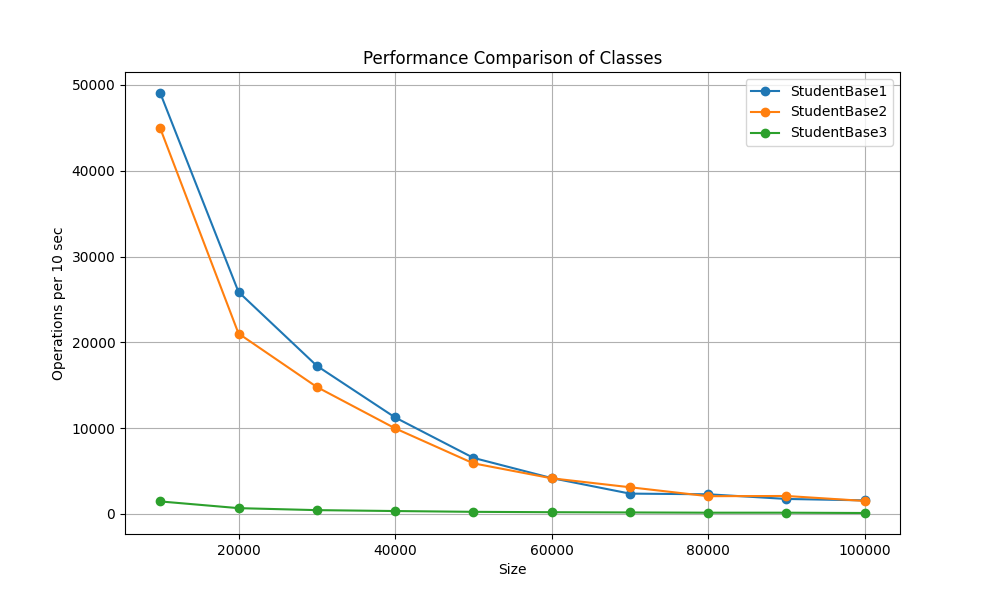
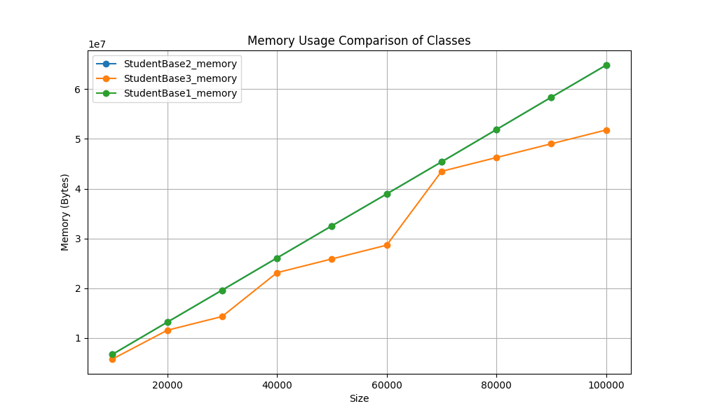
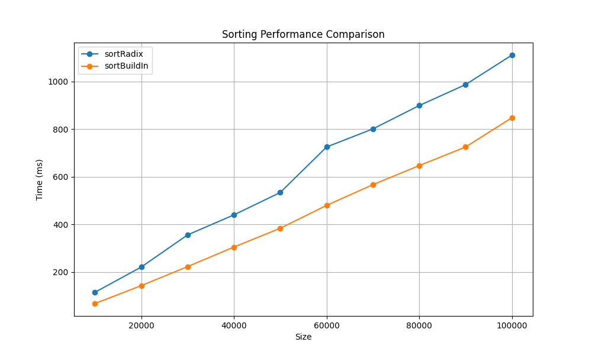

**Варіант: V1, S3**

Потрібно було реалізувати 3 структури даних для максимальної ефективності виконання наступних операцій:
1) Знайти студентів за заданим ім'ям і прізвищем (m_name, m_surname)
2) Знайти такі групи, де є студенти з однаковими (m_name, m_surname)
3) Змінити групу студенту за його електронною поштою (m_email)

## Операції

- **Перша реалізація (StudentBase1)**:
	- Структури: `std::list<Student>`, `std::unordered_map<(name,surname) -> std::vector<Student*>>`, `std::unordered_map<((name,surname),group) -> size_t>`, `std::unordered_map<email -> Student*>`.
	- Алгоритм:
		- `getStudentsByName`: хеш-пошук по `(name,surname)` повертає вектор вказівників (O(1) в середньому випадку).
		- `getGroupsSameStudentName`: ітерація по map лічильників трійок → збирає групи з count>1 (O(n)).
		- `changeGroupByEmail`: хеш-пошук за `email`, оновлення лічильників для старої/нової групи (O(1) середньо).
	- Складність: getStudentsByName O(1) avg, getGroupsSameStudentName O(n), changeGroupByEmail O(1) avg. Додаткова пам'ять O(n) для індексів.
    - Реалізація використовує оптимальні структури та алгоритми (для мінімізації часу виконання), так як всі операції виконуються з мінімально можливою складністю

- **Друга реалізація (StudentBase2)**:
	- Структури: `std::list<Student>`, `std::map<(name,surname) -> std::vector<Student*>>`, `std::map<((name,surname),group) -> size_t>`, `std::map<email -> Student*>`.
	- Алгоритм:
		- `getStudentsByName`: пошук у `std::map` (O(log M)) на результат.
		- `getGroupsSameStudentName`: ітерація по `studentGroupCountMap` (O(m)).
		- `changeGroupByEmail`: пошук email у map (O(log n)) і оновлення лічильників (O(log m)).
	- Складність: getStudentsByName O(log n), getGroupsSameStudentName O(n), changeGroupByEmail O(log n). Більші витрати пам'яті через вузли `std::map`.

- **Третя реалізація (StudentBase3)**:
	- Структури: `std::vector<Student>`.
	- Алгоритм:
		- `getStudentsByName`: лінійний скан вектора, порівняння полів (O(n)).
		- `getGroupsSameStudentName`: лінійний скан з тимчасовим `unordered_set` трійок для виявлення повторів (O(n) середньо).
		- `changeGroupByEmail`: лінійний пошук по email і оновлення (O(n)).
	- Складність (асимпт.): всі операції O(n); мінімальні постійні витрати пам'яті (тільки масив студентів), тимчасова O(n) для деяких запитів.
    - Реалізація є оптимальною по пам'яті, однак операції виконуються неоптимально

## Сортування
Використовується два підходи:
- `sortBuildIn` — локалізоване порівняння з `std::sort` / `std::ranges::sort`, складність O(n log n).
- `sortRadix` — MSD radix по українських буквах (34 bucket'и), складність ≈ O(n * L), L — середня довжина ключа (сума довжин імені та прізвища).

## Продуктивність

Як і очікувалось реалізація через геш таблиці найшвидша, з використанням дерев трохи повільніша, з вектором значно повільніша.


Витрати по пам'яті для геш таблиць та дерев приблизно однакові, для вектора витрати менші, так як нічого крім масиву з студентами не зберігається.


Обидва методи сортування за графіком асимптотично подібні, однак час для Radix sort трохи більший. Для наданого файлу на 100000 входжень radix sort ще не отримує достатньої переваги так як $log_2(n) \approx 16,6$, що співставне з сумарною довжиною імені та прізвища. Для більших файлів переваги Radix sort можуть краще проявитись.

## Структура проєкту:
- 3 реалізації баз студентів зберігаються в ```./src```
- Реалізація сортування зберігажться за шляхом ```./src/student_base_sort.cpp```
- Більш детальні результати бенчмарків зберігаються в ```./benchmarks/benchmark-results```
- Графіки порівнянь зберігаються в ```./benchmarks/benchmark-plots```
